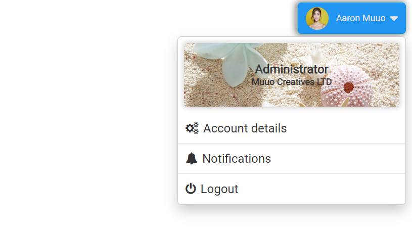

# Profile Dropdown

Simple profile dropdown button that can be embedded in navigation bar.This provides users with a convenient way to access their profile details, account information, and links to other pages within a web application or website. When the user clicks the "Profile" button, a dropdown menu is displayed, offering access to various options and information related to their account.

## Languages

HTML, CSS, Js

Screenshot 1

Screenshot 2

